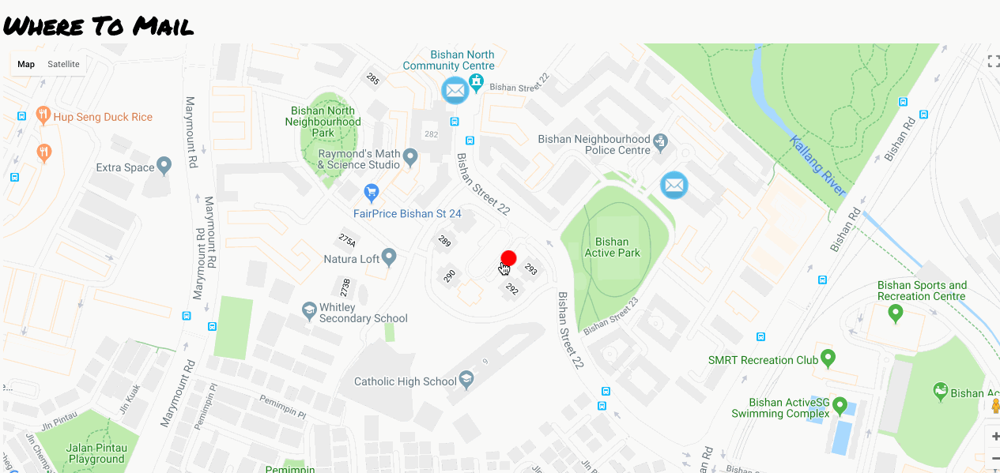

# Where To Mail

A mobile-friendly React app that helps you locate the nearest post box or post office based on your current location (Singapore only). Notable features include:

- Current location detection on both web and mobile (Requires approval of current location detection when prompted)
- Markers indicate locations of all 860 postbox and post office for mailing of letters and small packages.
- Info Window indicates distance of mailing location from current location
- Link to get directions opens in Google maps application on mobile devices or Google maps on the browser.

Play around with the app here at https://where-to-mail.herokuapp.com/



## Getting Started
These instructions will get you a copy of the project up and running on your local machine for development and testing purposes. See Deployment for notes on how to deploy the project on a live system.

### Installation
Here are the steps to download a local copy of the app

```
1. Fork the repo.
2. $ git clone https://github.com/timmoti/where-to-mail.git
3. $ npm install 
```

## Deployment
Use either [Heroku](https://www.heroku.com), [Now](https://zeit.co/now), or [Netlify](https://www.netlify.com) to deploy the app after pushing the code to your Github

## Built With
- [create-react-app](https://www.npmjs.com/package/create-react-app)
- [google-maps-react](https://github.com/fullstackreact/google-maps-react) (Google maps component library)
- [material-ui](https://material-ui.com) (Info Window typography)

## Author
Timothy Tan

## License
This project is licensed under the MIT license

## Acknowledgements
- Gordon Song (For imparting precious knowledge on React App development)
- Muhammad Yamin (For offering troubleshooting advice when needed)

## Sidenote
This project was borne out of a frustration of not being able to find a nearby post box or post office when one is needed. 

Google maps was my first port of call but was surprised that while post office locations can be found easily, post box locations aren't.

Best alternative was from the Singpost website which although contains information on all post boxes and post offices in Singapore, does not detect current location and does not allow one to select both post box and post office locations. 

 
